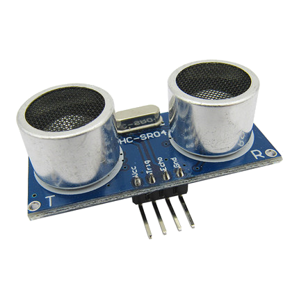
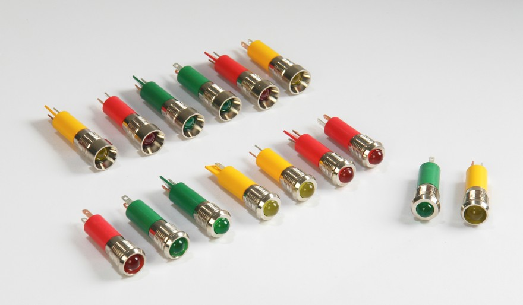
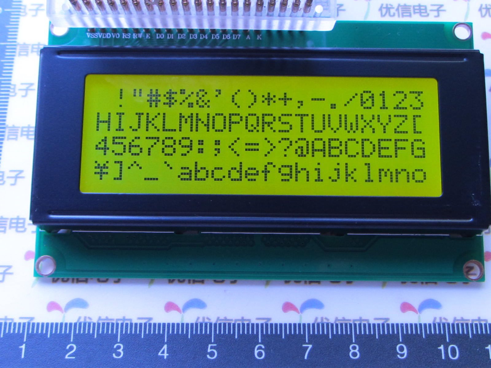
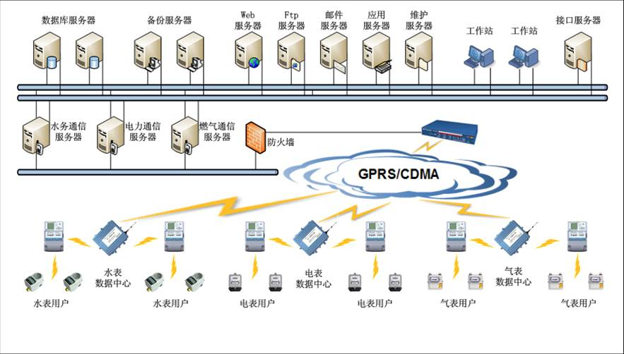

# 设备自动化设计从0到1

>Author: [winxos](https://winxos.github.io)
>
>Revision: 2019-11-09 修订了部分章节内容，重新编排了pdf文件
>
>Create:    2016-11-08 初稿

[TOC]
<div style="page-break-after: always;"></div>
## 课时1-2

## 序言

### 设备自动化设计从0到1

全面实现自动化生产是提高生产力的重要手段，而自动化设备的设计需要机械、电路、编程等方面设计师深度配合，而现在常见的学校培养目标和教材在这几个方面间存在很大的鸿沟，作为机械科班出生，笔者深知学机械的很少电控和程序写得好，而非机械专业的学生更不可能能够把机械本体设计好，而一个好的产品必须是要各个方面精益求精，所以造成目前能够进行总体设计的人少之又少。

所以一直有个想法，想编写一份简短的设计指南，能够让非自动化相关专业同学对自动化设备系统设计有个全面的了解，所以就有了这个项目的诞生，

- 希望能够给机械专业的同学提供以基础的电控及程序方面的参考。
- 给机电专业的同学提供编程水平如何提高的参考。
- 给计算机相关专业的同学提供如何通过代码控制设备的参考。

本指南假定读者已经有了基本的编程及相关基础，预计内容为8课时。

md文件采用TYPORA编写，建议将整个项目clone下来，在电脑安装typora软件阅读，这样阅读体验最佳。

winxos 2016-11-10

## 前言

​	作为一线教师和机器人创新实验室指导老师及一线项目参与者，作者深知大学各专业间的隔阂造成了产品总体设计上人才的缺失，导致国内整体设计水平低下，原因分析如下：

一个典型的机电一体化产品不可避免的包含：**机械结构设计**、**控制系统设计**、**软件设计**、**外观设计**等。

1. 机械结构设计等必然是要求机械相关专业的人来完成，但问题在于机械专业课程繁重，**电子电工学**、**程序设计**等犹如走马观花，平时缺少兴趣和足够的练习时间，导致不足百分之一的学生能够在软硬件设计上达到能够设计的程度。机械设计是一个学习周期非常长的领域，入门看似容易，实则非常困难，需要非常多的经验进行铺垫，导致虽然大学有机电工程等看似和机械挂靠很紧密的专业，但实际上**机械设计方向除了纯粹的机制专业外，其它专业几乎不可能完成相关工作**。当然如果其它专业学生自学完全部机制方面课程也应该算是机制的学生了。
2. 自动化、机电相关专业学生控制系统设计为本行，稍加兴趣和勤奋进行设计应该不难，但是大学专业可能多半仅限于八位微控制器系统设计，教材又是重复了若干年的老掉牙的读物，程序设计几乎仅仅是能够工作而已，很少会顾及代码格式及运行效率的问题，更鲜有稍大规模系统设计经验的学习，所以实际上代码能写的好的学生寥寥无几。
3. 计算机专业的学生理所应当代码应该写的很好，实则不然，笔者看过很多数据统计，普通本科院校几乎百分之九十的计算机专业毕业学生会从事前端开发，像核心课程《操作系统》，《编译原理》能学的好的学生也同样少之又少，要是跟硬件挂钩，更是全民公敌。

​        例子多的数不胜数，专业之间的隔阂程度如此之大令人吃惊，因为对其它专业的不了解，以至于会深刻的影响到产品设计时的团队协作。一个好的机电产品，必然是要各方面精益求精，协同设计，而不是各个部分暴力的拼接。所以笔者一直觉得十分有必要产生一门课程，给低年级学生以指导，让其能够快速的对以后可能有影响的相关专业进行必要的了解，只要方向对了，以后自己在根据自己喜好进行一些侧重，势必会对自己今后工作上给予很大的帮助。

​	之前提到机械需要较多经验，所以建议机械的东西还是机制的人来做，所以机械方向的东西我就不谈，外观的东西除了在极限设计的情况下，一般来讲跟产品功能的耦合度也较低，所以直接由工业设计相关专业人员完成即可。剩下的就是控制和代码的问题了，所以本内容适用范围为：**有兴趣了解机电产品设计整个流程的初级人员**。具体的来讲，机械相关学生适合全文通读，自动化相关学生可以直接看提高篇，计算机相关学生可以侧重看看初级篇和中级篇。

​	本教程非常基础，初期规划了8个课时，目的在于抛砖引玉，给由兴趣的学生以指引。整个内容托管在github上，地址为：https://github.com/winxos/device_automation_from0to1 ，如有任何疑问或建议，或者内容的添加等，欢迎到Issues提交，希望大家一起来分享知识，给新人创造更好的学习环境。

<div style="page-break-after: always;"></div>
## 初级篇

### 原理图

原理图，是表示电路板上各器件之间连接关系的图表。


### PCB图

PCB图详细描绘了电路板的走线，元件的尺寸及位置等，目前最常用的软件为 **Altium Designer**。


<div style="page-break-after: always;"></div>
### PCB生产过程

PCB制作方法主要有**热转印法**，**感光湿膜法，感光干膜法**。详细的生产工艺大家自行搜索解决，**热转印+氯化铁腐蚀**是自己手工制作的最佳首选，大致上分为几个步骤：

#### 1. 打印pcb至热转印纸


#### 2. 转印至铜板


#### 3. 腐蚀


<div style="page-break-after: always;"></div>
#### 4. 清洗及钻孔


当然，工业上面工艺要复杂很多，还要刷阻焊油墨、印丝层等才能做出像下面的效果。


在小批量生产的时候，我们只需要将PCB文件发给制造厂商，便能做出像上面一样的电路板，这个过程叫**打样**。厂家推荐深圳**嘉立创**，可以自助下单，打样质量高，速度快。

<div style="page-break-after: always;"></div>
### **芯片封装**

所谓封装是指安装半导体集成电路芯片用的外壳，它不仅起着安放、固定、密封、保护芯片和增强导热性能的作用，而且还是沟通芯片内部世界与外部电路的桥梁--芯片上的接点用导线连接到封装外壳的引脚上，这些引脚又通过印刷电路板上的导线与其他器件建立连接。常用的芯片封装形式有：

#### DIP双列直插式 (Dual In-LINE PACKAGE)

绝大多数中小规模集成电路(IC)均采用这种封装形式，其引脚数一般不超过100个。采用DIP封装的CPU芯片有两排引脚，需要插入到具有DIP结构的芯片插座上。


#### QFP方型扁平式 (Quad Flat PACKAGE)

芯片引脚之间距离很小，管脚很细，一般大规模或超大型集成电路都采用这种封装形式，其引脚数一般在100个以上。用这种形式封装的芯片必须采用贴片机将芯片与主板焊接起来。


#### BGA球栅阵列式 (BALL Grid Array PACKAGE)

现今大多数的高脚数芯片（如图形芯片与芯片组等）皆转而使用BGA(BALL Grid Array PACKAGE)封装技术。BGA一出现便成为CPU、主板上南/北桥芯片等高密度、高性能、多引脚封装的最佳选择。


还有很多各式各样的封装形式，详情大家可以自行搜索了解。

随着集成度的增加，封装形式也发生着很大的变化，对于一般机电产品来讲，DIP和QFP形式的封装是使用最多的。
<div style="page-break-after: always;"></div>
### Arduino入门
#### Arduino简介

​	Massimo Banzi 之前是意大利 Ivrea 一家高科技设计学校的老师。他的学生们经常抱怨找不到便宜好用的微控制器。2005年冬天， Massimo Banzi 跟David Cuartielles 讨论了这个问题。David Cuartielles 是一个西班牙籍芯片工程师，当时在这所学校做访问学者。两人决定设计自己的电路板，并引入了Banzi 的学生 David Mellis 为电路板设计编程语言。两天以后，David Mellis 就写出了程式码。又过了三天，电路板就完工了。这块电路板被命名为**Arduino**。几乎任何人，即使不懂电脑编程，也能用 **Arduino** 做出很酷的东西，比如对传感器作出回应，闪烁灯光，还能控制马达。随后Banzi，Cuartielles，和Mellis把设计图放到了网上。版权法可以监管开源软件，却很难用在硬件上，为了保持设计的开放源码理念，他们决定采用Creative Commons(CC)的授权方式公开硬件设计图。在这样的授权下．任何人都可以生产电路板的复制品，甚至还能重新设计和销售原设计的复制品。人们不需要支付任何费用，甚至不用取得Arduino团队的许可。唯一被保留的只有**Arduino**这个名字，它被注册成了商标，在没有官方授权的情况下不能使用它。**Arduino**发展至今，已经有了多种型号及众多衍生控制器推出。


#### Arduino特点

##### **跨平台开发**

​	Arduino IDE可以在Windows、Macintosh OS X、Linux三大主流操作系统上运行。

##### **简单清晰**

​	Arduino IDE基于**processing** IDE开发，processing 是MIT 开发的一款编程语言，目的是让艺术家也能够学会用程序来表达自己。对于初学者来说，极易掌握，同时有着足够的灵活性。Arduino语言基于**c++**语言开发，同时包含了大量的框架库，使用起来非常的简单。

##### **开放性**

​	Arduino的硬件原理图、电路图、IDE软件及核心库文件都是开源的，在开源协议范围内里可以任意修改原始设计及相应代码。

##### **发展迅速**

​	2012年笔者在**《机器人创新实验》**课程中采用Arduino进行教学，那时Arduino中文书籍jd搜索只有2部，现在(2016)已经可以搜索出近百种。而且Arduino UNO国产板的价格已经从当年60左右降到了现在的10来块，各个模块也都出现急剧降价，*说明Arduino的使用量在成倍的增加*。在中小学的教育中，Arudino的使用也如同雨后春笋般发展。因为Arduino的种种优势，越来越多的专业硬件开发者已经或开始使用Arduino来开发他们的项目、产品；越来越多的软件开发者使用Arduino进入硬件、物联网等开发领域；大学里，自动化、软件，甚至艺术专业，也纷纷开展了Arduino相关课程。
<div style="page-break-after: always;"></div>
### 常用执行元件

- 直流电机

   

  直流电机应用比较广泛，启动力矩大，规格多，可以直接使用pwm来进行速度控制，通常要配合行程开关来进行使用。

- 步进电机

   

  步进电机通常需要配合步进电机控制器使用，常用于控制精度要求较高的场合，价格较贵。

  

- 舵机

   

  舵机常用于转角非周转的场合，一般输出角度为0-180°。可细分为模拟舵机和数字舵机。其中数字舵机自带控制电路，响应速度快，精度高，价格较贵。

- 伺服电机

   

  伺服电机一般用于位置、速度、加速度控制精度有高要求的场合，使用简单，价格非常贵。

- 电磁铁

   

  电磁铁通电就可以产生直线位移，驱动力一般，价格便宜，不能长期（数十秒）处于通电状态。

- 电动推杆

   

  一种直线驱动元件，内部集成了行程开关，驱动力大，到位后会自动断电。

<div style="page-break-after: always;"></div>
### 常用传感器

- #### 行程开关

   

  行程开关常用于机器回到初始位置以及经过检测，寿命长。

- #### 环境温湿度传感器

   

  用于要求不高的环境温湿度检测，单总线通信方式，精度一般。

- #### 热电偶传感器

   

  利用热电效应制成，用于高温环境检测。

- #### 霍尔传感器

   

  利用霍尔效应制成，一般用于经过检测，或者高精度距离检测，检测距离较短。

- #### 红外接近传感器

   

  利用红外线反射原理制成，一般用于经过检测，检测范围一般最大数十厘米，易受灰尘等影响。

- #### 超声波测距模块

   

  利用超声波反射原理制成，一般用于障碍检测，检测范围一般最大数米，对反射面大小及发射角度有要求。

  

- #### 悬臂梁称重模块

   

  利用悬臂梁受力弯曲原理制成，精度较高，量程一般数千克。

   

  体重秤称重模块，精度较低，价格便宜。

  

<div style="page-break-after: always;"></div>
### 常用显示模块

- #### LED

  ####  

LED一般用于指示灯，如利用闪烁频率的控制表示工作状态、故障情况，也可以用于信号传输（类似遥控器原理）。

- #### LED点阵

  ####  

广告牌用的较多，有专用的控制器及整套解决方案。

- #### LCD2004/LCD2004 I2C

字符屏在产品中使用较多，根据需求有多种规格可以选择，常用的2004表示可以显示20x4的英文字符，12864 表示可以显示 128x64 个像素点。



LCD2004


LCD12864


- #### 段式液晶


段式液晶一般用于正式产品，可以根据自身需求定做显示内容，每一段可以单独控制。

- #### oled屏


oled显示效果好，能够自发光，控制相对复杂，价格贵。

- #### 串口屏


串口屏只需要串口进行控制，集成了微处理器进行串口自定义命令解析，显示效果好，开发周期短，可以集成触摸屏，价格便宜。

### 推荐购买清单

​	俗话说动手操作是最好的学习方式，所以这里笔者根据多年教学经验，推荐了一些购买清单，大家可以根据自己情况进行选择性购买。这份清单是笔者教授**《机器人创新实验》**课程时对学生的建议，利用清单上的物品，大家可以做出**智能避障移动机器人**，**智能巡线移动机器人**，**智能温湿度采集器**等简易的自动化设备，能够让初学者尽快的熟悉设备自动化的核心原理。

[arduino学习购买清单.docx](https://github.com/winxos/device_automation_from0to1/raw/master/arduino%E5%AD%A6%E4%B9%A0%E8%B4%AD%E4%B9%B0%E6%B8%85%E5%8D%95.docx)

[电子制作工具购买清单.docx](https://github.com/winxos/device_automation_from0to1/raw/master/%E7%94%B5%E5%AD%90%E5%88%B6%E4%BD%9C%E5%9F%BA%E6%9C%AC%E5%B7%A5%E5%85%B7%E8%B4%AD%E4%B9%B0%E6%B8%85%E5%8D%95.docx)

> 注意：因商家原因，清单中的链接并不保证时效性，所以如果哪个链接失效了，请自行根据链接附带的图片重新寻找该物品。

<div style="page-break-after: always;"></div>
## 课时3-5 
## Arduino IDE

 [Arduino](https://www.arduino.cc/)是一款便捷灵活、方便上手的开源电子原型平台。包含硬件（各种型号的Arduino板）和软件（Arduino IDE)。


Arduino IDE界面非常简洁，基于Processing IDE进行开发的，写入代码只需要一键就可以完成。

 

Arduino对初学者来说最大的好处就是提供了大量的库供大家使用，几乎市面上常见的外设都能找到人家写好的驱动库，而且全部都是开源的，这样一来省了很多写代码的时间，二来可以学习人家代码是如何编写的，对大家编程水平提高会有重大帮助。

 

当Arduino 接入电脑后，需要先装好驱动，驱动跟Arduino 芯片密切相关，卖家都会提供，等以后熟悉了也可以直接根据Arduino上的USB转串口芯片来进行相应的驱动安装。驱动安装完后，在设备管理器当中就能看到Arduino对应的串口号。

装好驱动后，还需要设置开发板类型，以及端口号。

 

Arduino IDE集成了在线库管理器，点击上面就可以打开官方提供的很多Arduino库参考。

 

根据需要搜索自己需要的驱动，安装完后就可以使用这些库了。

<div style="page-break-after: always;"></div>
## Arduino语法学习

#### Serial 代码分析

```c++
void setup() {
  // put your setup code here, to run once:
  Serial.begin(9600);
}
void loop() {
  // put your main code here, to run repeatedly:
  Serial.println("I LOVE ARDUINO!");
}
```


#### Blink 代码 分析

```c++
void setup() {
  pinMode(13, OUTPUT);
}
void loop() {
  digitalWrite(13, HIGH);   // turn the LED on (HIGH is the voltage level)
  delay(1000);              // wait for a second
  digitalWrite(13, LOW);    // turn the LED off by making the voltage LOW
  delay(1000);              // wait for a second
}
```
#### Fade 代码分析

```c++
int led = 9;           // the PWM pin the LED is attached to
int brightness = 0;    // how bright the LED is
int fadeAmount = 5;    // how many points to fade the LED by
// the setup routine runs once when you press reset:
void setup() {
  // declare pin 9 to be an output:
  pinMode(led, OUTPUT);
}
// the loop routine runs over and over again forever:
void loop() {
  // set the brightness of pin 9:
  analogWrite(led, brightness);
  // change the brightness for next time through the loop:
  brightness = brightness + fadeAmount;
  if (brightness == 0 || brightness == 255) {
    fadeAmount = -fadeAmount ;
  }
  delay(30);
}
```
<div style="page-break-after: always;"></div>
#### Adafruit Motor shield library MotorTest代码分析

```c++
// Adafruit Motor shield library
// copyright Adafruit Industries LLC, 2009
// this code is public domain, enjoy!
#include <AFMotor.h>
AF_DCMotor motor(4);
void setup() {
  Serial.begin(9600);           // set up Serial library at 9600 bps
  Serial.println("Motor test!");
  // turn on motor
  motor.setSpeed(200);
  motor.run(RELEASE);
}
void loop() {
  uint8_t i;
  Serial.print("tick");
  motor.run(FORWARD);
  for (i = 0; i < 255; i++) {
    motor.setSpeed(i);
    delay(10);
  }
  for (i = 255; i != 0; i--) {
    motor.setSpeed(i);
    delay(10);
  }
  Serial.print("tock");
  motor.run(BACKWARD);
  for (i = 0; i < 255; i++) {
    motor.setSpeed(i);
    delay(10);
  }
  for (i = 255; i != 0; i--) {
    motor.setSpeed(i);
    delay(10);
  }
  Serial.print("tech");
  motor.run(RELEASE);
  delay(1000);
}
```
<div style="page-break-after: always;"></div>
#### LCD 2004 I2C 代码分析

```c++
//YWROBOT
//Compatible with the Arduino IDE 1.0
//Library version:1.1
#include <Wire.h>
#include <LiquidCrystal_I2C.h>

LiquidCrystal_I2C lcd(0x27, 20, 4); // set the LCD address to 0x27 for a 16 chars and 2 line display

void setup()
{
  lcd.init();                      // initialize the lcd
  lcd.init();
  // Print a message to the LCD.
  lcd.backlight();
  lcd.setCursor(3, 0);
  lcd.print("Hello, world!");
  lcd.setCursor(2, 1);
  lcd.print("Ywrobot Arduino!");
  lcd.setCursor(0, 2);
  lcd.print("Arduino LCM IIC 2004");
  lcd.setCursor(2, 3);
  lcd.print("Power By Ec-yuan!");
}
```
#### Arduino语法规则

通过以上分析，对Arduino语法规则应该有了大致的了解，实际上Arduino语法就是C++语法，然后集成了一些已经编制好的系统函数供大家使用。

#### Arduino常用函数

* pinMode()
* digitalRead()
* digitalWrite()
* analogRead()
* analogWrite()
* delay()
* delayMicroseconds()
* pulseIn()

更多内容请参考：https://www.arduino.cc/en/Reference/HomePage

<div style="page-break-after: always;"></div>
## Arduino制作智能小车

### 小车底盘拼装

 

### 红外对管安装

 


### LCD2004安装

 

此款屏幕采用 I2C方式驱动，连线方式：

**LCD2004:	ARDUINO**

VCC:		5V

GNC:		GNN

SDA:		A4

SCL:		A5

### 驱动板安装

 


## 课后作业

**设计一款避障小车**

### 任务要求

1. 利用红外对管或者超声波传感器进行障碍检测；
2. 利用LCD 2004进行信息显示，如是否检测到障碍，当前车子运行状态等；
3. 遇到问题请自行通过搜索网络资源解决；

<div style="page-break-after: always;"></div>
## 课时6-8

## 中级篇 

### 微控制器主要厂商

 

- 排名第一的瑞萨为日立与三菱半导体部门合并成立，在汽车等行业市场独占鳌头。

- 排名第二的恩智浦半导体前身为皇家飞利浦公司部门之一，在通信，汽车，NFC，电视盒，手机等领域使用较多，2015年3月以118亿美金收购摩托罗拉子公司飞思卡尔半导体，于2016年10月被高通以470亿美金收购。

- 排名第三的微芯科技在8位微控制器，EEPROM存储芯片等市场份额较大，其主打产品PIC系列使用量非常大。2015年5月以36亿美金收购Atmel公司，Arduino UNO主处理器atmaga328p就是Atmel公司AVR微控制器系列的8位处理器产品。

- 排名第四的意法半导体为意大利SGS半导体和法国Thomson半导体公司合并而成，其STM32各系列产品使用特别广泛。

- 剩下的几个也都是巨无霸，例如TI的MSP430系列非常经典，自己以后可以根据需求进行相应了解。


### 控制方案设计步骤

#### 1. 需求分析

- 硬件运行环境？工况？抗核辐射？

- 软件运行环境？是否有特殊要求？

- 任务实时性要求？

- 任务数据存储量？

- 是否需要接入以太网？蓝牙是否可以？

- 模拟量采样速度是否有特殊要求？

- 交互性是否有特殊考虑？


这些要辅助甲方来完成需求的挖掘。

#### 2. 微控制器选型

1. 实时性有无要求？秒级？毫秒级？微秒级？实时性上来分可以选51系列，cortex M系列，fpga系列等
2. 是否要低功耗?目前低功耗有MSP432，STM32L系列等。

3. 抗干扰性是否有特殊要求? 工作环境有无特殊要求？高温度？

4. 外设资源的要求?几路串口？USB?CAN?需要多少IO口?

5. 需要多少存储空间?一般来讲，代码占用达到几十KB flash 空间已经很大了，如果需要存储额外的数据，数据量不大可以考虑选flash大一些的系列，如果数据量很大可能需要外扩flash芯片来存储。


#### 3. 最小系统设计

1. 选好MCU型号后，网上可以找到最小系统设计原理图。建议熟悉几款常用的MCU，这样代码以后可以互用，遇到问题网上参考资料也比较多。

2. 对于初次使用的MCU，建议初期先到网上购买相应MCU的最小系统开发板，先行进行MCU相应编程环境及特性的熟悉，熟练操作IO口，中断等编程，等等。

3. 然后再参考最小系统设计添加自己所需的其他外围电路原理图，制作PCB图。

4. 初版打样，在嘉立创打样可以同时自动购买相应的元器件，拿到板子后进行焊接，运行最简单的代码以确保电路板设计没有什么问题，如果遇到问题，看是否可以通过手工搭飞线、划断线路等手段手工修复，最后再一起统一修改设计，如果不能则修改相应电路原理图及PCB图，再次打板，重复此步骤。

5. 软件设计要考虑的因素更多，和硬件设计一样，需要非常多的经验，所以需要持续的进行资料阅读、学习。

#### 系统设计总述
总体来讲，一个好的设计，笔者认为应该至少具备以下特性：

   1. **极端稳定性**：系统能够进行各种异常处理，尽可能多的考虑极端工作环境；
   2. **易于扩展性**：系统添加新的功能应该很容易，而且不能影响到已有功能的实现；
   3. **易于维护性**：系统已有功能升级或修改，需要修改的地方应该尽可能的少；
   4. **性能高效性**：系统应该根据需求提高软硬件时间上、空间上的性能；
   5. **资源重用性**：系统软硬件很多部分应该尽可能设计成模块化，方便其他项目重用；

当然要做到上面几点，需要多思考设计模式，多学习他人的案例，多加积累，非一蹴而就。

### 时序图


芯片工作是在时序电路控制下一步步进行的，通常用时序图的形式来表明相关信号的先后顺序。

要操作外部芯片，通常都是通过一些通信协议来完成，不同的通信协议时序图是不一样的，一般在确定好外部器件后，就可以查阅芯片手册，手册上都带了芯片工作时序图，按照时序图来编写代码，就可以和芯片进行通信了。

### 驱动编写

驱动编写一般流程是读芯片手册，这部分内容对于初学者可能有一定的难度，所以要多加练习，成功了一个简单的，慢慢就可以操作更复杂的时序了。这里以1602为例，简单进行分析。

详细参考：http://www.51hei.com/mcu/4327.html


图 1602 液晶显示器


图 写时序

其中：

1. RS是命令/数据选择引脚，接微控制器的一个I/O，当RS为低电平时，选择命令；当RS为高电平时，选择数据。
2. RW是读/写选择引脚，接微控制器的一个I/O，当RW为低电平时，向LCD1602写入命令或数据；当RW为高电平时，从LCD1602读取状态或数据。如果不需要进行读取操作，可以直接将其接VSS。
3. E是使能引脚，接微控制器的一个I/O。
4. DB0—DB7，并行数据输入/输出引脚，可接微控制器的P0—P3任意的8个I/O口。

```c
void Write1602_Com(uint8 com)
{
    E=0;
    RS=0;                    //命令
    Delay(50);               //延时
    RW=0;                    //写         
    Delay(50);
    PORT=com;                //端口赋值
    Delay(50);
    E=1;                     //高脉冲
    Delay(50);
    E=0;
}
```

``` c
void Write1602_Dat(uint8 dat)
{
    E=0;
    RS=1;                    //数据
    Delay(50);               //延时
    RW=0;                    //写
    Delay(50);
    PORT=dat;                //端口赋值
    Delay(50);
    E=1;                     //高脉冲
    Delay(50);
    E=0;
} 
```

我们也可以合并两个函数为一个两个参数的函数，如下：

``` c
void Write1602(uint8 type,uint8 dat)
{
    E=0;
    RS=type;                 //0 命令 1 数据
    Delay(50);               //延时
    RW=0;                    //写
    Delay(50);
    PORT=dat;                //端口赋值
    Delay(50);
    E=1;                     //高脉冲
    Delay(50);
    E=0;
} 
```

### 常用通讯协议

常用的通信协议有 UART/USART, SPI, I2C, 单总线, CAN, USB 等等，需要大家慢慢的积累操作经验。

当遇到复杂时序图调试时，可能需要**逻辑分析仪**来进行硬件调试。

<div style="page-break-after: always;"></div>
## 提高篇

### 中断

CPU在处理某一事件A时，发生了另一事件B， CPU暂时中断当前的工作，转去处理事件B（中断响应和中断服务），待CPU将事件B处理完毕后，再回到原来事件A被中断的地方继续处理事件A（中断返回），这一过程称为中断。

中断可以是硬件触发的，也可以是软件自己内部触发的。常用的中断有定时器中断和外部中断。

比如说有个按钮，我们把它一端连接在cpu引脚上，另外一端连接在地上。我们可以把引脚配置为默认电信号一直是高，只有当你按钮按下去时，引脚连到了地上，电信号才会变成低。我们可以把cpu对应的引脚配置为中断触发模式，那么当按钮按下时，cpu就能在第一事件收到信号，这个时间非常短，可以到微秒级甚至更低。

中断不是必须的，采用中断的设计一般是为了提高系统的实时性。cpu需要执行完中断内的代码才会回到之前代码继续运行，所以中断内的代码应该尽可能的短小，和功能简单，一般只是设计一些标志位，原则上不能执行任何耗时的代码，这样才不至于影响到其他任务的执行。

一般来说，可以采用扫描的方式来代替外部中断，实时性也能达到毫秒级。

中断是个很重要的概念，更具体的内容应该自己去看相关资料。

### 功耗控制

大部分的机电设备不需要特别的考虑功耗问题，因为微控制器相对设备本身来讲功耗非常低，而设备一般都是有持续电源输入。

但是当需要设计没有持续电源输入的设备时，比如智能手表，野外气象站等，就需要考虑这个问题。

要实现低功耗可能要从以下几方面入手考虑：

1. 硬件的选择，不同厂商的芯片可能功耗出入很大，MSP430以及STM32L系列都是做的非常好的产品。
2. 降低时钟频率，时钟频率越低，功耗越低。
3. 关闭不用资源。
4. 采用低功耗工作模式，利用定时器中断及外部中断定期唤醒。
5. 选用低功耗外设。

通过上面的处理，往往可以实现成百上千倍的续航时间。

### 内存管理

微控制器上内存资源一般较为匮乏，所以要合理的规划内存的使用。分清楚编译器对系统内存规划，弄清堆(heap)和栈(stack)的区别和分配，弄清flash区，eeprom区（如果有）的操作，需要做到大致心中有数。在项目初期就应该学会对系统内存等资源的估算，以便选择最合适的微控制器。这方面知识需要深入理解编译器及硬件工作原理，需要循序渐进。

### 数据结构与算法设计

虽然现在微处理器在内存大小及处理速度相对以前有了很大的提高，数据结构和算法变得没有以前要求那么高，可以通过提高硬件规格来弥补算法上的劣势，但是在一些极端的场合下，一些复杂的应用场景使得并不能够通过提高硬件来获得较大的性能改善，而且性能提高，成本和功耗都会显著提高，这对产品是非常不利的，所以在嵌入式设备上，数据结构与算法尤为重要。这些方面有大量的书籍可供参考，参考书目里已经包含这部分知识基础内容，已经足够大家日常使用。

### 合作式调度器设计

#### 常见程序框架

> 注意，本小节中的代码大部分都是不完整的，类似于伪代码，如果直接运行是无法运行的，需要自行添加其他内容，关键是用于核心知识讲解。

```c
int main()
{
  sys_init();
  while(1)
  {
    update_sensors();
    make_decision();
    execute_decision();
  }
  return 0;
}
```

这是自动控制系统的经典框架，一般任务已经可以胜任了。

#### 有什么问题？

while循环执行一次需要多少时间？
如果其中某个环节耗时非常久会怎么样？
如果需要执行多个对时间有精确时序要求的任务应该怎么办？

#### 任务挑战

控制2个LED灯，其中一个每亮0.1s，灭0.9秒交替，另一个每亮0.5s，灭0.5s交替？
第一个灯我们可以这样

```c
void f1()
{
  digitalWrite(led1,HIGH);
  delay(100);
  digitalWrite(led1,LOW);
  delay(900);
}
```
第二个我们这样
```c
void f2()
{
  digitalWrite(led2,HIGH);
  delay(500);
  digitalWrite(led2,LOW);
  delay(500);
}
```
综合起来怎么办呢？

<div style="page-break-after: always;"></div>
也不是没有办法，经过一段时间的思考，我们可以想到这样的方式:

```c
void f3()
{
  digitalWrite(led1,HIGH);
  digitalWrite(led2,HIGH);
  delay(100);  
  digitalWrite(led1,LOW);
  delay(400);
  digitalWrite(led2,LOW);
  delay(500);
}
```

我们分别将led1和led2的时序图画出来，发现是对的，但是上面的f3函数存在很大的问题：

1. 改一发而动全身，可能因为某些原因，需要led2的运行规律发生变化，那么所有的led的延时都要重新计算。
2. 如果要控制的对象更多的话，这个延时就很难把握了，函数会异常的复杂。

##### 有没有更好的更通用的解决办法呢？

经过我们认真的思考，会发现问题出在delay()函数上，因为每个任务的delay之间会影响，这样就导致了整个运行时间发生变化，能否减少这种影响呢？我们来看另外一种不同的实现办法：

```c
void f4(int frame)
{
  int time_in_seconds=frame%1000;
  if(time_in_seconds<100)
  {
    digitalWrite(led1,HIGH);
  }
  else
  {
    digitalWrite(led1,LOW);
  }
}
void f5(int frame)
{
  int time_in_seconds=frame%1000;
  if(time_in_seconds<500)
  {
    digitalWrite(led2,HIGH);
  }
  else
  {
    digitalWrite(led2,LOW);
  }
}
long frame=0;
void loop()
{
  frame++;
  f4(frame);
  f5(frame);
  delay(1);
}
```

上面的代码中，除了loop函数外，其他地方没有delay，所以几乎是微秒级完成，那么我们的全局变量frame实际上就实现了每1毫秒自增1，有了绝对时间的概念，f4和f5就可以解耦了。而且我们的loop的响应速度几乎能达到1毫秒。

在上面的代码中，f4，f5实现功能简单，但是代码却不少，如果需要，我们也可以优化如下，但这这样代码可读性就不如上面高了。

``` c
long frame=0;
void loop()
{
  frame++;
  frame%1000<100?digitalWrite(led1,HIGH):digitalWrite(led1,LOW);
  frame%1000<500?digitalWrite(led2,HIGH):digitalWrite(led2,LOW);
  delay(1);
}
```

上面的代码利用了条件运算符来进行代码的缩减，代码量迅速减小，但是是否已经达到最小代码量了呢？我们再深入思考，会发现digitalWrite函数的第二个参数实际上就是前面表达式的值，所以还能优化如下：

```c
long frame=0;
void loop()
{
  frame++;
  digitalWrite(led1,frame%1000<100);
  digitalWrite(led2,frame%1000<500);
  delay(1);
}
```

代码明显比上面的要更精简，但是可读性下降了，但是随着自己见识的增加，这些小tricks可以说是非常容易在其他人代码里面看到的。通过上面的迭代例子，我是想给大家传达一个思想，**要写好代码不仅仅是实现功能就行，还要思考这样是否是最佳的解决方案了，通用性、易读性、编码速度、运行速度、内存占用等的权衡是否达到了比较优的方案，**通过自己不断的思考以及网络上的学习，自己水平就会慢慢提升，每过段时间再回顾以前自己的代码，就能发现自己的变化。慢慢也能够分辨出来网络上各种代码编写者的水平高低。

上面的方案还有什么需要提高的地方呢？

<div style="page-break-after: always;"></div>
最大的就是通用性问题，因为点灯这个任务比较简单，如果任务比较复杂，而且有很多种的话，就会出现问题。比如我们考虑下面的代码：

``` c
long frame=0;
void loop()
{
  frame++;
  f1(frame);
  f2(frame);
  f3(frame);
  f4(frame);
  f5(frame);
  delay(1);
}
```

这个框架中，代码中f1-f5可以自己根据时间来实现不同的功能，扩展起来也比较方便，唯独的问题就是整个loop的时间实际上是f1-f5全部执行时间加上1毫秒还有frame++的时间，因为任务较多情况下，f1-f5的总执行时间跟1毫秒比起来就可能不是那么容易忽略了，这样就造成frame的自增的时间实际上并不是1毫秒，就会导致系统并未达到我们当初的设计要求。

##### 有没有缓解办法？

当然有，我们分几个部分来考虑这个问题：

1. 将delay(1)改为delay(10)

   这样frame的自增时间变成10毫秒，导致任务所占的比例减少，及时准确性就会提高。

2. 不用delay，将frame++放到硬件定时器当中

   因为硬件计数器是采用硬件中断来完成的，并不受到f1-f5的影响，这样loop代码中就只有f1-f5的函数体而已，将frame声明成全局变量

3. 让f1-f5依此执行，每次loop只执行其中一个，下次就换成下一个执行

   这样loop的总时间就不是f1-f5的和，而是其中最长时间，代码如下：

   ``` c
   long frame=0,state=0;
   void timer_10ms()
   {
     frame++;
   }
   void loop()
   {
     switch(state)
     {
       case 0:f1(frame);break;
       case 1:f2(frame);break;
       case 2:f3(frame);break;
       case 3:f4(frame);break;
       case 4:f5(frame);break;
     }
     state++;
     if(state>4)
     {
       state=0;
     }
   }
   ```

经过上面的优化，我们的代码框架实际上就已经具备调度器的雏形了，因为系统能够实现在多个任务中切换，因为每个任务执行的很快，在外部看来就像是多个任务同时在运行。

上面的代码在一般的项目上使用已经足够了，可能的问题就是如果添加任务，要修改loop中的switch语句，还要修改下面的state的极限值，当工程比较小的时候，这个影响是比较小的，还有的就是每个任务执行频率是相同的，要实现不同频率执行就要在函数内部通过if语句来实现。

##### 上面的代码能否再优化呢？

```c
void msg_update() {
	do_something();
}
void screen_update() {
	do_something();
}
void key_scan() {
	do_something();
}
sch_init_task();
sch_add_task(msg_update, 0, 11);            // 110 ms
sch_add_task(screen_update, 0, 50);
sch_add_task(key_scan, 0, 1);
while (1) {
  sch_run_tasks();
}
```

main.c 伪代码

可以看到上面的代码非常的容易理解，而且扩展起来很方便，如何才能实现上面的效果呢？

``` c
#define SCH_MAX_TASKS   (4)
struct __attribute__((__packed__)) sTask
{
    void (* pTask)(void);
    u16 Delay;
    u16 Period;
    u8 RunMe;
};
```
xxx.h 部分头文件

``` c
/*
 * schedule.c, for system control.
 * Created on: 2015-4-10
 * Author: winxos
 */
#include "public.h"
struct sTask sch_tasks[SCH_MAX_TASKS];
void sch_run_tasks(void) {
	s16 index=SCH_MAX_TASKS;
	while(index >0)
	{
		index--;
		if (sch_tasks[index ].RunMe > 0)
		{
			(*sch_tasks[index ].pTask)(); // Run the task
			sch_tasks[index ].RunMe = 0; // Reset / reduce RunMe flag
			if (sch_tasks[index].Period) {
				sch_tasks[index ].Delay = sch_tasks[index ].Period;
			}
			else if (sch_tasks[index ].Period == 0)
			{
				sch_delete_task(index);
			}
			break;
		}
	}
	sch_goto_sleep();
}
u8 sch_add_task(void (*pFunction)(), const u16 delay, const u16 period) {
	u8 index = 0;
	while ((sch_tasks[index].pTask != NULL) && (index < SCH_MAX_TASKS)) {
		index++;
	}
	if (index == SCH_MAX_TASKS) {
		return SCH_MAX_TASKS;
	}
	sch_tasks[index].pTask = pFunction;
	sch_tasks[index].Delay = delay;
	sch_tasks[index].Period = period;
	sch_tasks[index].RunMe = 0;
	return index; // return position of task (to allow later deletion)
}
u8 sch_delete_task(const u8 index) {
	u8 ret;
	if (sch_tasks[index].pTask == 0) {
		ret = ERROR;
	} else {
		ret = SUCCESS;
	}
	sch_tasks[index].pTask = 0x0000;
	sch_tasks[index].Delay = 0;
	sch_tasks[index].Period = 0;
	sch_tasks[index].RunMe = 0;
	return ret;
}
u8 sch_init_task(void) {
	s16 index = SCH_MAX_TASKS;
	while(index > 0)
	{
		index--;
		sch_tasks[index].pTask = 0x0000;
		sch_tasks[index].Delay = 0;
		sch_tasks[index].Period = 0;
		sch_tasks[index].RunMe = 0;
	}
	return SUCCESS;
}

inline void sch_update(void) {
	s16 index = SCH_MAX_TASKS;
	while(index > 0)
	{
		index--;
		if (sch_tasks[index ].pTask) {
			if (sch_tasks[index].Delay == 0) {
				sch_tasks[index].RunMe = 1; // Set the run flag
			} else {
				sch_tasks[index].Delay -= 1;
			}
		}
	}
}
```
xxx.c 合作式调度器伪代码

``` c
#pragma vector = TIMER0_A0_VECTOR
__interrupt void Timer_A0(void) {
	sch_update();
}
```

yyy.c 定时器中断10ms触发

上面代码中用到了函数指针，这样在使用的时候就可以运行我们自定义的函数了，函数指针算是c语言中比较高级的内容了，不熟悉的请自行查阅。上面实际上已经是一个完整的**合作式调度器**的代码了，可以非常方便的移植到各种微控制器上。

##### 调度器完成

上面的代码就是个完整的合作式调度器代码，调度器分成**合作式**和**抢占式**，合作式就是各个任务不会打断其它任务，依次调度，抢占式就是各个任务可能会被其它任务中断。其中合作式调度器实现起来简单，内存占用小，甚至可以运行在89c51这类资源非常少的微控制器上，应该是项目上的首选。但是也有一些**局限性**，就是每个单独任务的执行时间不能超过调度最大时间，不然系统响应时间就没法保证，解决办法就是将耗时的任务拆分成一系列子任务来运行。详细的情况要自己进行更深入的学习。

<div style="page-break-after: always;"></div>

### 大型项目文件管理

在大型系统设计时，各个模块及文件的划分非常重要，C语言中，.h,.c的文件包含关系要仔细的规划，弄清定义和声明，弄清编译器预编译过程，系统框架设计的好，就可以使得代码重用率高，维护方便，这方面需要非常丰富的经验，当你开始考虑这些问题的时候，你已经远远脱离本教程范围了。

### 软件工程

软件工程是研究和应用如何以系统性的、规范化的、可定量的过程化方法去开发和维护软件，以及如何把经过时间考验而证明正确的管理技术和当前能够得到的最好的技术方法结合起来。

软件工程的目标是：在给定成本、进度的前提下，开发出具有适用性、有效性、可修改性、可靠性、可理解性、可维护性、可重用性、可移植性、可追踪性、可互操作性和满足用户需求的软件产品。追求这些目标有助于提高软件产品的质量和开发效率，减少维护的困难。

这部分的内容在项目开发、管理上非常的有帮助。

### 设计模式

设计模式就是针对一系列特定问题而提供的模板化的解决方案，最早由4位计算机科学家 Erich Gamma、Richard Helm、Ralph Johnson 和 John Vlissides在著作 《**设计模式：可复用面向对象软件的基础**》 中提出，文中提到Design Patterns一词出自建筑设计师 亚历山大 的《**建筑的永恒之道**》。

在该书中一共提出了23种模式，用于解决复杂系统设计时可能遇到的问题。这四人也被成为GANG OF FOUR（四人帮）

设计模式在系统架构层面才会有所体现，其中很多模式大家可能都已经用过了，但是该书将这些技巧抽象出来，该书的内容理解跟读者自身当前水平有很大关系，需要多年积累经验反复阅读，才能掌握其中较难的一些模式，但是学以致用，很多复杂的模式有可能一辈子都接触不到，大家可以作为知识储备，逐步的掌握。

### GIT的使用

这部分的知识并不仅限于代码的编写，实际上是为了解决项目大了之后各个部分耦合过于严重，导致后期扩展及维护会产生很大的开销，这些内容在项目大了之后才会显现出来，比如代码行数达到数万行，又比如需要数十人同时协作开发一个项目。

项目协作其中最主要的就是版本管理系统，当前最主流的为GIT和SVN系统，GIT是LINUX之父开发的分布式管理系统，著名的Github就是基于Git开发的，这部分知识只是用于给大家了解，当以后遇到这些问题了，知道灯塔在何处。

### 安全性问题

知识产权的保护在当今越发的重要，辛苦多年的结晶可能人家几天就成功剽窃。通过专利等方式进行保护当然是非常重要的环节，但是如果自己适当的提高他人抄袭的门槛，就能很大限度上保护我们的产品。

防止硬件破解？

防止非法修改存储数据？

防止通信数据被截获？甚至修改？

这些内容也需要丰富的经验，需要不断的学习。

### 物联网系统框架

​	物联网(IOT)是当今大势所趋，通过将各个终端接入互联网，可以实现更好的优化配置资源。随着WIFI等芯片价格越来越低，以后设备接入互联网会变成常态。所以这里对整个系统框架做些原理性介绍，更多的内容需要自己去补充。

​	

​	一个典型的物联网拓扑结构如上图，各种设备通过有线网，WIFI，蓝牙，ZIGBEE等网关接入互联网，使得用户可以在任何有网络的地方对设备进行管理和查看，也可以统一对各种设备进行数据挖掘，发现各种隐含的信息。



水表电表物联网系统框架图

我们可以看到常规物联网系统按照用户角色主要分为三大部分，简单介绍如下：

1. 设备终端

   ​	各种设备通过各种模块采用某些协议接入互联网，很多嵌入式芯片内置支持很多协议，如果不支持也可以通过外接模块来实现互联网接入。如果要使得该系统具有更大的兼容性，能够被第三方接入，就需要采用标准协议，目前物联网方面使用比较广的有MQTT协议，由IBM开发，现在很多智能设备都支持该协议。

2. 客户端

   ​	客户端通常可以分为PC端，移动端。PC端目前主要需要考虑Windows、MAC端，移动端主要包含Android，iOS端。常规的开发不同的平台差异很大，开发工具也各不相同。

   ​	所以目前还有另外一种开发方式，就是将客户端做成浏览器版，这样就能够实现各个平台共用客户端，浏览器方式开发相当于将软件做成网页的形式，采用HTML5+CSS+JAVASCRIPT的方式进行开发，这样就能实现多个平台统一开发，这种开发方式目前在响应速度，用户体验上还比不上原生平台开发。

   ​	为了解决HTML5开发的局限，现在还有一种做法就是混合开发，结合以上两种开发方式，现在很多应用，像手机淘宝，京东等都是采用这种方式。

3. 服务器端

   服务器端负责存储、分析各种数据，传递用户消息等功能，根据用户量及运行场合要求，服务器数量以及架构都会有很大的变化，对于一般情况来讲，服务器一般构造如下：

   * 硬件上来说，可能是大型机，也可能是微型机，同普通PC比起来特点是稳定性要高很多，因为服务器一般是全年持续运行，对于自己学习来说，可以采用当今流行的树莓派来进行服务器开发，目前最新的型号为树莓派 3B，价格只需要200RMB左右，就可以实现网站搭建及后台服务一直在线。
   * 运行系统上来说，主流是Linux系统，还有小部分Windows系统。Linux系统中又以Ubuntu，CentOS，Fedora等市场份额比较大，不同的系统在环境配置上略有区别。
   * 服务器环境上来说，Apache，Nginx等比较流行。
   * 编程语言上来说，Java, C++, Javascript,  Python, Ruby, Go语言等都比较流行，都有相应的开发框架。

这块已经是非常庞大的系统了，在具体实施过程中还会有大量的问题需要解决，在实际项目中最好找相应的协作团队来完成。

## 总结

全文8个课时的时间非常紧凑，对于初学者来讲只能囫囵吞枣，因为文中内容都是最切实际，最核心的一些知识，只能给大家宏观上的参考，这些内容真的要掌握的融会贯通，那可能800个课时都远远不够，而且这些内容并不是设备自动化的全部，紧紧是最简单的一些设备开发经验，但是这些是基础中的基础，大家掌握了之后，再深入的学习嵌入式开发，就能起到事半功倍的效果。希望大家在探求知识的路上勇往直前，得到更大的收获。

全文完。

## 实验内容

#### 1. Arduino、各传感器、模块熟悉

提前完成小车机械结构搭建。

完成软件安装，驱动安装。

简单介绍各个模块，答疑。

#### 2. 串口使用

用串口给电脑发送特定字符串。

讲解通信物理过程。

介绍波特率基础知识。

#### 3. 全彩LED模块使用

操作全彩LED实现特定颜色变化。

学会数字、模拟写IO口。

#### 4. LCD2004 I2C模块使用

学会LCD2004 I2C库函数下载、使用。

学会屏幕内容各项操作。

简单介绍I2C 协议。

#### 5. 温湿度传感器 DHT11使用

学会DHT11 库函数下载、使用。

学会温湿度采集。

简单介绍单总线协议。

#### 6. 超声波模块使用

利用超声波实现距离探测。

讲解超声波模块工作原理。

#### 7. 电机驱动模块使用

学会L293D驱动模块使用。

控制电机正反转及调速。

#### 8. 超声波避障小车制作

综合实验6、7，完成本实验。

学会基本反馈控制框架。

#### 9. 使用蓝牙模块制作遥控小车

课后大作业、自己完成。

采用蓝牙串口 SPP 做上位机。

学会串口接收操作。

#### 10. 带LCD、温湿度显示、避障功能、远程控制功能智能小车制作

课后大作业、自己完成。

<div style="page-break-after: always;"></div>
## 参考书目

|  [](http://item.jd.com/11097323.html)   |  [](http://item.jd.com/1626458326.html) | [](http://item.jd.com/11273708.html)  |  [](http://item.jd.com/11768609.html)   |
| ---- | ---- | ---- | ---- |
|  [](http://item.jd.com/11969202.html)|  [](http://item.jd.com/11917487.html) | [](http://item.jd.com/11733233.html) | [](http://item.jd.com/10057441.html)  |
| [](http://item.jd.com/11446466.html) |  [](http://item.jd.com/11666296.html) |  [](http://item.jd.com/11883948.html) |      |
